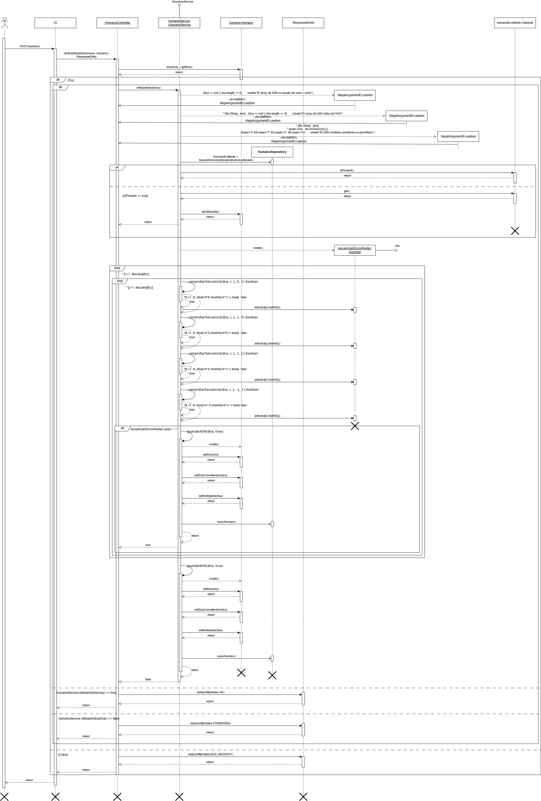
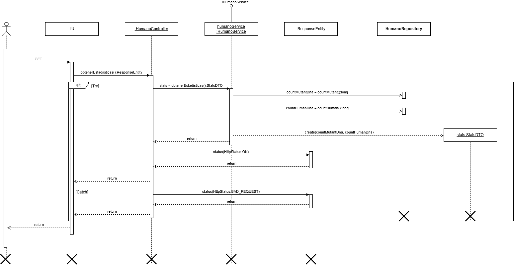

# Proyecto: Detección de Mutantes

Magneto ha encomendado el desarrollo de un sistema capaz de identificar mutantes a partir de sus secuencias de ADN, ayudando en su lucha contra los X-Men. Este proyecto desarrollado en Java con Spring Boot implementa un algoritmo para detectar mutantes, expone una API REST y almacena datos en una base de datos H2.

## Descripción

El sistema evalúa si un humano es mutante o no, basándose en secuencias de ADN de NxN compuestas únicamente por las letras A, T, C y G. Se considera mutante si en el ADN se detectan más de una secuencia de cuatro letras iguales de forma horizontal, vertical u oblicua.

## Requisitos del Proyecto

### Nivel 1
- **Algoritmo**: Se desarrolló un algoritmo eficiente en Java para identificar secuencias mutantes.
- **Arquitectura**: Se implementó el proyecto en una arquitectura en capas con controladores, servicios y repositorios.

### Nivel 2
- **API REST**: Se crea un servicio en `/mutant/` que detecte mutantes a partir de una secuencia de ADN en formato JSON, recibiendo peticiones HTTP POST.
  ```json
  POST /mutant/
  {
  "dna": ["ATGCGA", "CAGTGC", "TTATGT", "AGAAGG", "CCCCTA", "TCACTG"]
  }
  ```
  - **Respuesta**: HTTP 200-OK para mutantes, 403-Forbidden para no mutantes.
- **Hosting**: Se desplegó la API en un servicio de cloud computing **Render**.

### Nivel 3
- **Base de Datos H2**: Se almacenan los ADN verificados, sin duplicados.
- **Estadísticas**: Se implementa el endpoint `/stats` para devolver estadísticas de ADN en JSON:
  ```json
  {
      "count_mutant_dna": 40,
      "count_human_dna": 100,
      "ratio": 0.4
  }
  ```
- **Pruebas de Carga**: Se utiliza JMeter para garantizar la estabilidad ante altos volúmenes de tráfico.
- **Pruebas Automáticas**: Tests con JUnit con un code coverage > 80%.

## Instrucciones de Ejecución

1. **Descargar el repositorio como un zip**

2. **Configurar el entorno**:
   - Se deben tener Java y Maven instalados.
   - Se deben configurar las propiedades de la base de datos H2 en `application.properties`.

3. **Ejecutar el proyecto**:
   - Una vez cofigurado el proyecto se ejecuta `ParcialDswApplication`.

4. **Pruebas**:
   - Para ejecutar las pruebas y comprobar el code coverage, se ejecutan `HumanoControllerTest` y `HumanoServiceTest`

5. **Pruebas de rendimiento**:
   - Para realizar las pruebas de stress se debe configurar y ejecutar pruebas de carga en JMeter.

6. **Acceder a los servicios**:
   - Detección de mutantes: `POST /mutant/`
   - Estadísticas: `GET /stats`

## Deploy

Link del Deploy en Render: https://apimutant.onrender.com/

## Documentación

**Diagrama de Secuencia**

El siguiente diagrama muestra el flujo de la detección de mutantes:



El siguiente diagrama muestra el flujo para obtener las estadisticas de mutantes:


